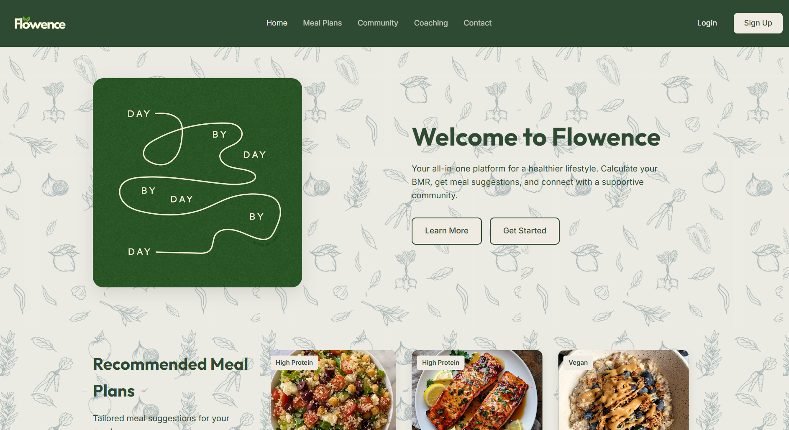
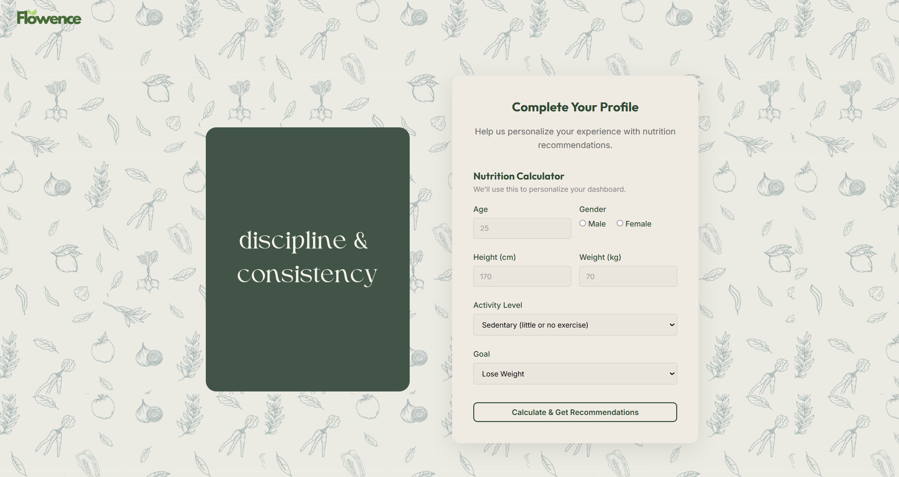
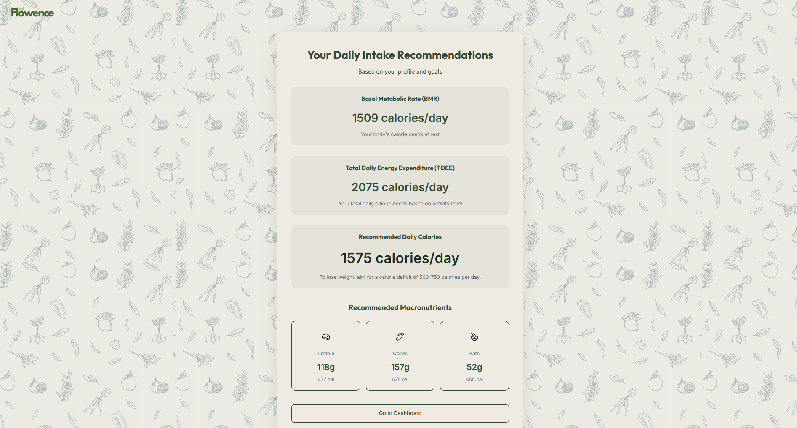
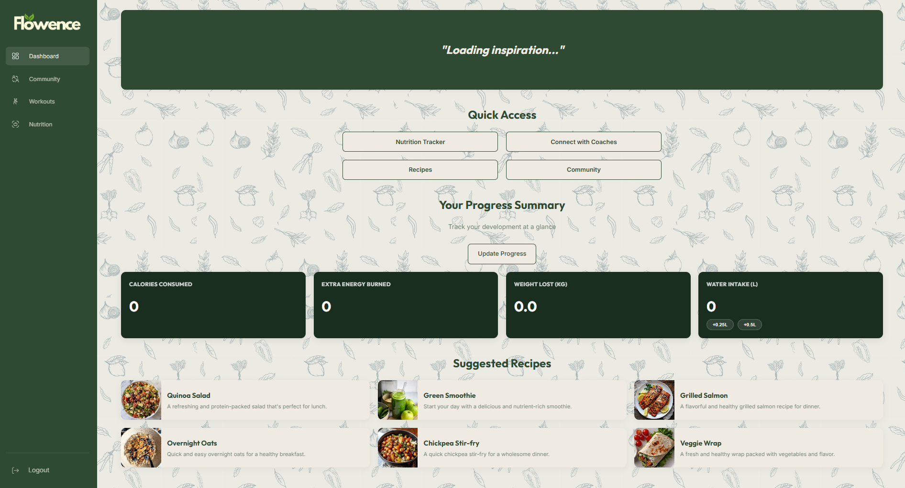

# 🌿 Flowence – Reach Your Peak

> One platform for fitness, nutrition & mindset — no more switching between 5 apps.


---

##  About the Project

Most people use 3–5 different apps to manage their wellness — one for workouts, one for nutrition, one for motivation. **Flowence** brings everything together in one clean, beginner-friendly platform.

---

##  Features

| Module | Description |
|---|---|
| 🏋️ Workout Plans | Filter by gym/home, beginner/advanced, duration |
| 🥗 Nutrition Guide | Meal suggestions, macros breakdown, healthy recipes |
| 🧮 BMR/TDEE Calculator | Personalized daily calorie recommendations |
| 📊 Progress Tracker | Weight, calories burned, streaks & badges |
| 💬 Daily Motivation | Quotes, mindfulness tips & challenges |
| 🔐 User Accounts | Register, login, personal profile & dashboard |
| 🎮 Gamification | Badges, streaks & social sharing |

---

##  User Roles

- **Visitor** — Browse workouts and meals without an account
- **User** — Full dashboard, progress tracking & calculators
- **Fitness Coach** — Add and manage workout content
- **Admin** — Manage users, content & usage analytics

---

##  Tech Stack

```
Frontend   → HTML5, CSS3, JavaScript
Design     → Responsive layout (mobile + desktop)
Validation → JavaScript client-side form validation
Marketing  → Digital marketing strategy + social media
```

---

## Live Demo
 **[View Flowence live](https://eya-khelifi.github.io/flowence/)**

---

##  Screenshots






---

##  Project Structure

```
flowence/
├── index.html        ← Main homepage
├── style.css         ← Stylesheet
├── script.js         ← JavaScript & calculators
├── pages/            ← Subpages
├── images/           ← Images and icons
└── README.md         ← This file
```

---

##  Author

**Eya Khelifi** — Business Information Systems, Esprit School of Business  
Aspiring IT Project Manager | Tunis, Tunisia

[](https://www.linkedin.com/in/eya-khelifi-5046ab357/)


---

*"Wellness should be simple. Flowence makes it simple."*
